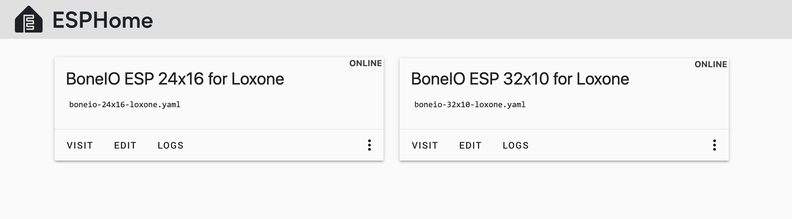

# BoneIO - Loxone integration

## Content

This repository contains:

**1) YAML files for integrating BoneIO ESP modules with Loxone using ESPHome**
   - [boneio-32x10-loxone.yaml](boneio-32x10-loxone.yaml) → for BoneIO ESP 32x10A
   - [boneio-24-16-loxone.yaml](boneio-24-16-loxone.yaml) → for BoneIO ESP 24x16A

**2) Templates for importing Virtual Inputs & Outputs into Loxone Config**
   - [VIU_BoneIO_Digital_Inputs.xml](VIU_BoneIO_Digital_Inputs.xml) and [VO_BoneIO_Digital_Outputs-32x10.xml](VO_BoneIO_Digital_Outputs-32x10.xml) → for BoneIO ESP 32x10A
   - [VIU_BoneIO_Digital_Inputs.xml](VIU_BoneIO_Digital_Inputs.xml) and [VO_BoneIO_Digital_Outputs-24x16.xml](VO_BoneIO_Digital_Outputs-24x16.xml) → for BoneIO ESP 24x16A

> [!NOTE]
> This repository assumes you are already familiar with:
> * Using **ESPHome** to upload configurations to BoneIO
> * Working with **Loxone templates** in **Loxone Config**
>
> If not, please refer to the official documentation or tutorials before proceeding. A detailed manual is not planned here.

> [!TIP]
> The easiest way to use **ESPHome** in a Loxone environment is to install [**LoxBerry**](https://wiki.loxberry.de/en/start) on a Raspberry Pi or other platform, add the [**Docker plugin**](https://wiki.loxberry.de/plugins/docker/start), and run an [**ESPHome container**](https://hub.docker.com/r/esphome/esphome).
You don’t need Home Assistant to (re)configure BoneIO.

## Description

This integration utilizes **bidirectional UDP communication**:
* **BoneIO** listens on port **8888** for commands from Loxone Miniserver
* **Loxone Miniserver** listens on port **9999** for updates from ESP.

These default port numbers can be changed if needed.

Each digital input (DI) and digital output (DO) follows a structured naming format:
* DI1, DI2, …, DI35 - Inputs
* DO1, DO2, …, DO32 - Outputs

After importing the templates into **Loxone Config**, all inputs and outputs will be **automatically mapped and ready to use**.

### Virtual Inputs (Example)

### Virtual Outputs (Example)

## Credits

* YAML configurations are based on the factory configs from [BoneIO](https://github.com/boneIO-eu/esphome)
* The UDP server implementation was provided by [hzkincony](/hzkincony/esphome-loxone/tree/main/components/loxone)
* Updates and modifications to UDP component (via a fork) were made by [chudini93](https://github.com/chudini93/esphome-loxone-readonly)
